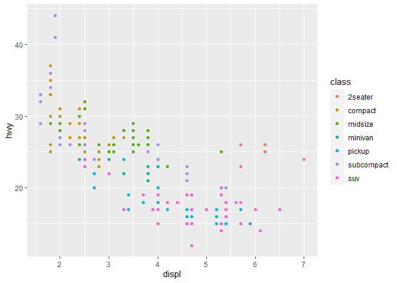
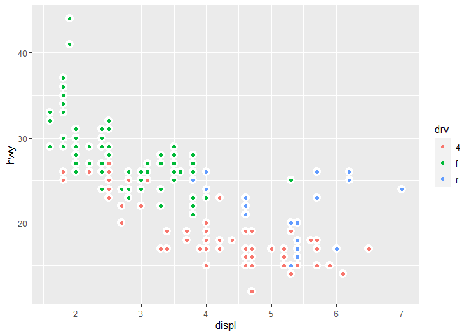

# Found-of-Empirical-Research-HM1
HM 1
================
by Tamires Amorim
2/5/2021

## Homework\#1

1.loading main package

``` r
library(ggplot2)
```

    ## Warning: package 'ggplot2' was built under R version 4.0.3

``` r
library(dplyr)
```

    ## Warning: package 'dplyr' was built under R version 4.0.3

    ## 
    ## Attaching package: 'dplyr'

    ## The following objects are masked from 'package:stats':
    ## 
    ##     filter, lag

    ## The following objects are masked from 'package:base':
    ## 
    ##     intersect, setdiff, setequal, union

``` r
library(plotly)
```

    ## Warning: package 'plotly' was built under R version 4.0.3

    ## 
    ## Attaching package: 'plotly'

    ## The following object is masked from 'package:ggplot2':
    ## 
    ##     last_plot

    ## The following object is masked from 'package:stats':
    ## 
    ##     filter

    ## The following object is masked from 'package:graphics':
    ## 
    ##     layout

``` r
library(purrr)
```

    ## Warning: package 'purrr' was built under R version 4.0.3

``` r
library(stringi)
```

    ## Warning: package 'stringi' was built under R version 4.0.3

``` r
library(stringr)
```

    ## Warning: package 'stringr' was built under R version 4.0.3

``` r
library(tidyverse)
```

    ## Warning: package 'tidyverse' was built under R version 4.0.3

    ## -- Attaching packages --------------------------- tidyverse 1.3.0 --

    ## v tibble  3.0.3     v readr   1.3.1
    ## v tidyr   1.1.2     v forcats 0.5.0

    ## -- Conflicts ------------------------------ tidyverse_conflicts() --
    ## x plotly::filter() masks dplyr::filter(), stats::filter()
    ## x dplyr::lag()     masks stats::lag()

``` r
library(DT)
```

    ## Warning: package 'DT' was built under R version 4.0.3

## 3.2.4 Exercises

### 1.Run ggplot(data = mpg). What do you see?

That line of coding only shows a empty square with no content
inside.Although, when I used the ggplot2::mpg, I was able to see the
table with information of different vehicles, as manufacturer, model,
engine size, fuel efficiency and so on.

``` r
ggplot2::mpg
```

    ## # A tibble: 234 x 11
    ##    manufacturer model    displ  year   cyl trans   drv     cty   hwy fl    class
    ##    <chr>        <chr>    <dbl> <int> <int> <chr>   <chr> <int> <int> <chr> <chr>
    ##  1 audi         a4         1.8  1999     4 auto(l~ f        18    29 p     comp~
    ##  2 audi         a4         1.8  1999     4 manual~ f        21    29 p     comp~
    ##  3 audi         a4         2    2008     4 manual~ f        20    31 p     comp~
    ##  4 audi         a4         2    2008     4 auto(a~ f        21    30 p     comp~
    ##  5 audi         a4         2.8  1999     6 auto(l~ f        16    26 p     comp~
    ##  6 audi         a4         2.8  1999     6 manual~ f        18    26 p     comp~
    ##  7 audi         a4         3.1  2008     6 auto(a~ f        18    27 p     comp~
    ##  8 audi         a4 quat~   1.8  1999     4 manual~ 4        18    26 p     comp~
    ##  9 audi         a4 quat~   1.8  1999     4 auto(l~ 4        16    25 p     comp~
    ## 10 audi         a4 quat~   2    2008     4 manual~ 4        20    28 p     comp~
    ## # ... with 224 more rows

### 2.How many rows are in mpg? How many columns?

There are 234 rows and 11 columns.

### 3.What does the drv variable describe? Read the help for ?mpg to find out.

It means the the type of drive train, where f = front-wheel drive, r =
rear wheel drive, 4 = 4wd.

### 4\. Make a scatterplot of hwy vs cyl.

``` r
ggplot(data = mpg) + 
  geom_point(mapping = aes(x = hwy, y = cyl))
```

<!-- -->

### 5\. What happens if you make a scatterplot of class vs drv? Why is the plot not useful?

Because it not a clear representation of the relationship between the
“type” of car and type of drive train, we cannot draw any conclusion
from visualizing this graph.

``` r
ggplot(data = mpg) + 
  geom_point(mapping = aes(x = class, y = drv))
```

<!-- -->

## 3.3.1 Exercises

### 1\. What’s gone wrong with this code? Why are the points not blue?

The coding bellow is wrong because it positioned the parentheses in the
wrong place. It included the color blue as an object to be classified in
the graph.

``` r
#ggplot(data = mpg) + 
#  geom_point(mapping = aes(x = displ, y = hwy, color = "blue"))
```

The correct code to turn the points in the plot blue, will add the
variables x and y separated from “color = blue” by using parentheses:

``` r
ggplot(data = mpg) + 
  geom_point(mapping = aes(x = displ, y = hwy), color = "blue")
```

<!-- -->

### 2\. Which variables in mpg are categorical? Which variables are continuous? (Hint: type ?mpg to read the documentation for the dataset). How can you see this information when you run mpg?

The categorical variables are manufacturer, model, trans, drv, fl and
class. Continuous are displ, year, cyl, cty and hwy.  
The function glimpse() can show the variables.

``` r
glimpse(mpg)
```

    ## Rows: 234
    ## Columns: 11
    ## $ manufacturer <chr> "audi", "audi", "audi", "audi", "audi", "audi", "audi"...
    ## $ model        <chr> "a4", "a4", "a4", "a4", "a4", "a4", "a4", "a4 quattro"...
    ## $ displ        <dbl> 1.8, 1.8, 2.0, 2.0, 2.8, 2.8, 3.1, 1.8, 1.8, 2.0, 2.0,...
    ## $ year         <int> 1999, 1999, 2008, 2008, 1999, 1999, 2008, 1999, 1999, ...
    ## $ cyl          <int> 4, 4, 4, 4, 6, 6, 6, 4, 4, 4, 4, 6, 6, 6, 6, 6, 6, 8, ...
    ## $ trans        <chr> "auto(l5)", "manual(m5)", "manual(m6)", "auto(av)", "a...
    ## $ drv          <chr> "f", "f", "f", "f", "f", "f", "f", "4", "4", "4", "4",...
    ## $ cty          <int> 18, 21, 20, 21, 16, 18, 18, 18, 16, 20, 19, 15, 17, 17...
    ## $ hwy          <int> 29, 29, 31, 30, 26, 26, 27, 26, 25, 28, 27, 25, 25, 25...
    ## $ fl           <chr> "p", "p", "p", "p", "p", "p", "p", "p", "p", "p", "p",...
    ## $ class        <chr> "compact", "compact", "compact", "compact", "compact",...

### 3\. Map a continuous variable to color, size, and shape. How do these aesthetics behave differently for categorical vs. continuous variables?

When we map a categorical vs. continuous variables we get a warning
message that “using size for a discrete variable is not advised”.
Meaning that changing size, transparency or shape in a graph of
unordered variable to an ordered aesthetic will not convey a clear
picture of the information we want to obtain from the graph, as
observed.

``` r
ggplot(data = mpg) + 
  geom_point(mapping = aes(x = displ, y = hwy, shape = class))
```

    ## Warning: The shape palette can deal with a maximum of 6 discrete values because
    ## more than 6 becomes difficult to discriminate; you have 7. Consider
    ## specifying shapes manually if you must have them.

    ## Warning: Removed 62 rows containing missing values (geom_point).

<!-- -->

### 4\. What happens if you map the same variable to multiple aesthetics?

Multiple aesthetics do not convey clear information, only one is enough
to display the relationship between variables.

``` r
ggplot (mpg)+
geom_point(mapping=aes(x = displ, y = hwy, color =class, shape =class))
```

    ## Warning: The shape palette can deal with a maximum of 6 discrete values because
    ## more than 6 becomes difficult to discriminate; you have 7. Consider
    ## specifying shapes manually if you must have them.

    ## Warning: Removed 62 rows containing missing values (geom_point).

<!-- -->

### 5\. What does the stroke aesthetic do? What shapes does it work with? (Hint: use ?geom\_point)

The stroke aesthetics is used to modify the width of the border for
shapes that have border.

``` r
ggplot(mtcars, aes(wt, mpg)) +
  geom_point(shape = 21, colour = "black", fill = "white", size = 5, stroke = 5)
```

<!-- -->

### 6\. What happens if you map an aesthetic to something other than a variable name, like aes(colour = displ \< 5)? Note, you’ll also need to specify x and y.

It classifies the values bellow 5 as true and everything greater than 5
false.

``` r
ggplot(data = mpg) + 
  geom_point(mapping = aes(x = displ, y = hwy, colour = displ < 5))
```

<!-- -->

## 3.5.1 Exercises

### 1\. What happens if you facet on a continuous variable?

It does not display clear information. The faucet function works only
for discrete variables.

``` r
ggplot(mpg, aes(x = displ, y = hwy)) +
  geom_point() +
  facet_grid(~ cty)
```

<!-- -->

### 2\. What do the empty cells in plot with facet\_grid(drv \~ cyl) mean? How do they relate to this plot?

The plot bellow shows the combination of the quadrants that contain
information on the facet\_grid, for instance, the quadrant 4 and 4
contains data, but the quadrant 4 and r does not. The same is true for
all the other combinations in the facet-grid.

``` r
ggplot(data = mpg) +
  geom_point(mapping = aes(x = drv, y = cyl))
```

<!-- -->

``` r
ggplot(data = mpg) +
  geom_point(mapping = aes(x = hwy, y = cty)) +
  facet_grid(drv ~ cyl)
```

<!-- -->

### 3.What plots does the following code make? What does . do?

The dot is used to facet in different dimensions, the first showing the
rows, values on the y-axis, and the second showing the columns, values
on the x-axis.

``` r
ggplot(data = mpg) + 
  geom_point(mapping = aes(x = displ, y = hwy)) +
  facet_grid(drv ~ .)
```

<!-- -->

``` r
ggplot(data = mpg) + 
  geom_point(mapping = aes(x = displ, y = hwy)) +
  facet_grid(. ~ drv)
```

<!-- -->

### 4.Take the first faceted plot in this section:

``` r
ggplot(data = mpg) + 
  geom_point(mapping = aes(x = displ, y = hwy)) + 
  facet_wrap(~ class, nrow = 2)
```

<!-- -->

#### What are the advantages to using faceting instead of the colour aesthetic? What are the disadvantages? How might the balance change if you had a larger dataset?

When comparing the faceting version with the color aesthetic, it is
possible to observe how the information is more clearly presented in the
faceted plot. As observed bellow, where we break down the content in
different squares with its corresponding category. If the data was
larger then the color aesthetic would be even more confusing, because
the difference between colors would not be as evident. Color Aesthetic
example:

``` r
ggplot(data = mpg) +
  geom_point(mapping = aes(x = displ, y = hwy, color = class))
```

<!-- -->

### 5.Read ?facet\_wrap. What does nrow do? What does ncol do? What other options control the layout of the individual panels? Why doesn’t facet\_grid() have nrow and ncol arguments?

To control the number of rows and columns we use nrow and ncol
respectively. To change the order in which the panels appear, we can
also “change the levels of the underlying factor” (R Documentation). In
the facet\_grid() we do not use nrow and ncol arguments because the
number of the different variables will determine the number of rows and
columns.

### 6\. When using facet\_grid() you should usually put the variable with more unique levels in the columns. Why?

For better visualization purposes. To display the information clearly,
we add the variables with more unique levels in the horizontal.

## 3.6.1 Exercises

### 1\. What geom would you use to draw a line chart? A boxplot? A histogram? An area chart?

Line charts use geom\_line(). Boxplot uses geom\_boxplot(). Histograms
geo\_histogram() and area chart geom\_area()

### 2,Run this code in your head and predict what the output will look like. Then, run the code in R and check your predictions.

I predicted it would look like the scatter plot we ran above, but with
the shade and line above it.And I got it wrong.

``` r
ggplot(data = mpg, mapping = aes(x = displ, y = hwy, color = drv)) + 
  geom_point() + 
  geom_smooth(se = FALSE)
```

    ## `geom_smooth()` using method = 'loess' and formula 'y ~ x'

<!-- -->

### 3\. What does show.legend = FALSE do? What happens if you remove it? Why do you think I used it earlier in the chapter?

The show legend displays the legend box, removing it or setting to
=false will eliminate the legend box. Because there were three plots and
adding a legend to one plot, would make it difficult to see the
differences between the groups.

``` r
ggplot(data = mpg) +
  geom_smooth(
    mapping = aes(x = displ, y = hwy, colour = drv),
    show.legend = FALSE
  )
```

    ## `geom_smooth()` using method = 'loess' and formula 'y ~ x'

<!-- -->

### 4.What does the se argument to geom\_smooth() do?

Geo\_smooth, use a single geometric object to display multiple rows of
data. The se will add standard errors to the lines.

``` r
ggplot(data = mpg, mapping = aes(x = displ, y = hwy, color = drv)) + 
  geom_point() + 
  geom_smooth(se = TRUE)
```

    ## `geom_smooth()` using method = 'loess' and formula 'y ~ x'

<!-- -->

### 5\. Will these two graphs look different? Why/why not?

No. Because the code 2 will treat these mappings as global mappings that
apply to each geom in the graph. Meaning that code 2, will produce the
same plot as the previous code 1. This tool helps us avoid errors when
typing codes like code 1 multiple times

``` r
##CODE 1
ggplot() + 
  geom_point(data = mpg, mapping = aes(x = displ, y = hwy)) + 
  geom_smooth(data = mpg, mapping = aes(x = displ, y = hwy))
```

    ## `geom_smooth()` using method = 'loess' and formula 'y ~ x'

<!-- -->

``` r
##CODE 2
ggplot(data = mpg, mapping = aes(x = displ, y = hwy)) + 
  geom_point() + 
  geom_smooth()
```

    ## `geom_smooth()` using method = 'loess' and formula 'y ~ x'

<!-- -->

### 6\. Recreate the R code necessary to generate the following graphs.

``` r
ggplot(mpg, aes(x = displ, y = hwy)) +
  geom_point() +
  geom_smooth(se = FALSE)
```

    ## `geom_smooth()` using method = 'loess' and formula 'y ~ x'

<!-- -->

``` r
ggplot(mpg, aes(x = displ, y = hwy)) +
  geom_smooth(mapping = aes(group = drv), se = FALSE) +
  geom_point()
```

    ## `geom_smooth()` using method = 'loess' and formula 'y ~ x'

<!-- -->

``` r
ggplot(mpg, aes(x = displ, y = hwy, colour = drv)) +
  geom_point() +
  geom_smooth(se = FALSE)
```

    ## `geom_smooth()` using method = 'loess' and formula 'y ~ x'

<!-- -->

``` r
ggplot(mpg, aes(x = displ, y = hwy)) +
  geom_point(aes(colour = drv)) +
  geom_smooth(se = FALSE)
```

    ## `geom_smooth()` using method = 'loess' and formula 'y ~ x'

<!-- -->

``` r
ggplot(mpg, aes(x = displ, y = hwy)) +
  geom_point(aes(colour = drv)) +
  geom_smooth(aes(linetype = drv), se = FALSE)
```

    ## `geom_smooth()` using method = 'loess' and formula 'y ~ x'

<!-- -->

``` r
ggplot(mpg, aes(x = displ, y = hwy)) +
  geom_point(size = 4, color = "white") +
  geom_point(aes(colour = drv))
```

<!-- -->
